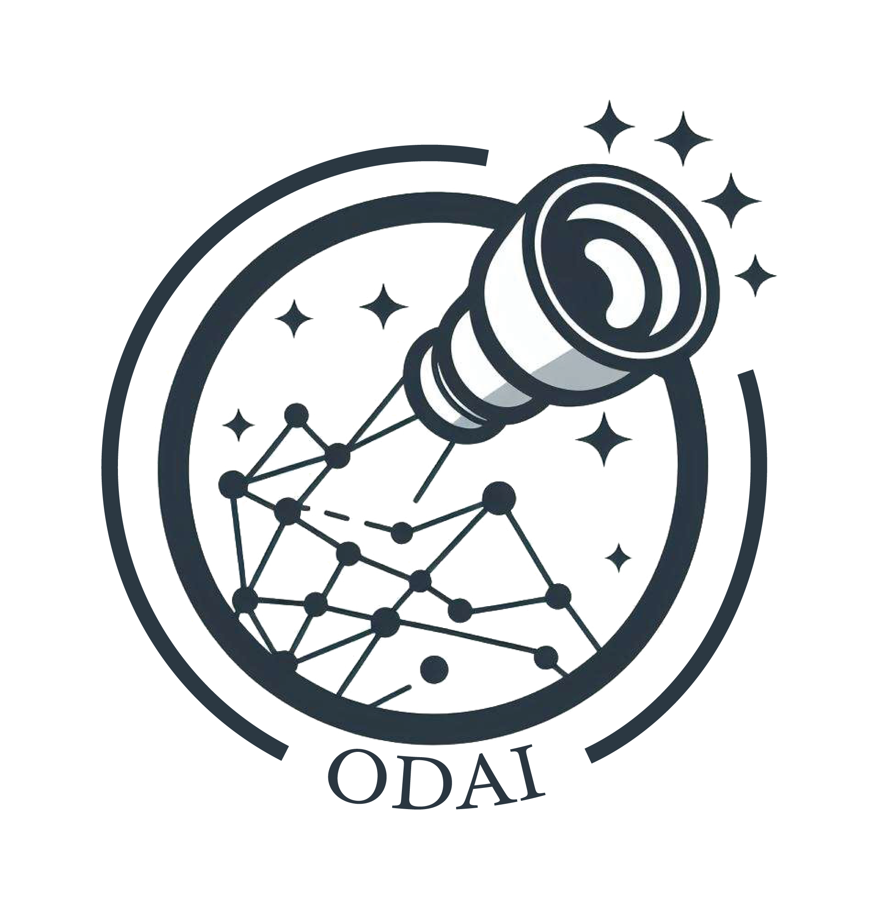

# Optical System Design Optimization: Saddle Point Method


Optical System Design Optimization introduces a groundbreaking approach for the systematic design of complex optical systems, like wide-angle eyepieces. This project transcends traditional optimization limits by leveraging the innovative saddle point construction method for a broader and more comprehensive exploration of the design space.

## Project Overview

This framework presents a unique optimization methodology for developing high-performance optical systems. By integrating advanced optimization strategies with conventional tools like CodeV, it pioneers a novel method for uncovering innovative optical solutions.

### Key Features

- **Flexible Design Framework**: Employs a saddle point construction method to generate numerous starting points, facilitating a wider exploration of the design space.
- **GUI-Driven Workflow**: Enhances accessibility and usability through a user-friendly graphical interface that manages the optical system design process.
- **CodeV Integration**: Seamlessly interfaces with CodeV for leveraging powerful local and global optimization capabilities.
- **Python-Powered Analysis**: Utilizes Python for added flexibility in data manipulation and analysis, including tree creation and merit function evaluation.

## Getting Started

Follow these steps to incorporate this framework into your optical design projects:

1. **Prepare Your Environment**:
   Ensure both Python and CodeV are installed on your system. This project requires functional installations of both.

2. **Clone the Repository**:
   Download the project to your machine by cloning the repository:
   ```sh
   git clone https://github.com/pierregab/ODAI.git
   ```

3. **Install Dependencies**:
   Install any required Python libraries using pip:
   ```sh
   pip install -r requirements.txt
   ```

4. **Launch the Application**:
   Execute the main application script to initiate the optimization process. The GUI will guide you through configuring your optical system for optimization.

## Contributing

Contributions to the project are highly encouraged. Whether you're refining optimization algorithms, enhancing the GUI, or expanding project utility, your involvement can significantly impact the field of optical system design.

## License

This project is licensed under the 3PL 3.0 License. For more information, please refer to the [LICENSE](LICENSE) file in the repository.

## Acknowledgements

We extend our gratitude to the teams at Télécom Physique Strasbourg and ICube Laboratory, Université de Strasbourg, for their invaluable support and contributions to this project.


